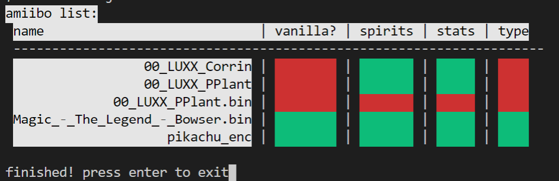

# What is this?

this is a validator I created to check amiibo bin files for spirit modifications.

## Usage

1. download the executable for your respective operating system over in the `releases` page
2. make a `to_validate` folder in the same place as this executable
3. place whatever bins you wish to validate in the `to_validate` folder you just created
4. run the executable

you should get output that looks something like this:

**Red** means the amiibo has been altered with the use of spirits.
**Green** means the amiibo has *not* been alterted with the use of spirits.

For the sake of displaying as much detail as possible, I also display what led to the conclusion
by showing the result for each piece of evidence.

This is all fully configurable using a `rules.txt` file!~

## How to Identify a Spirit-Influenced Amiibo

1. a vanilla amiibo should have no abilites
2. the stats on an amiibo should be 0
3. the `type` of amiibo should be grey/normal (as opposed to grab(green) / attack(red) / defense(blue) )